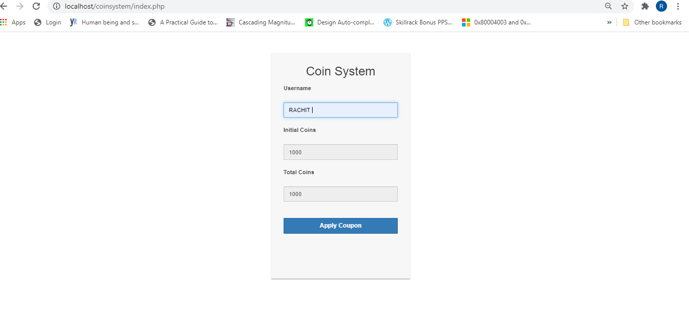
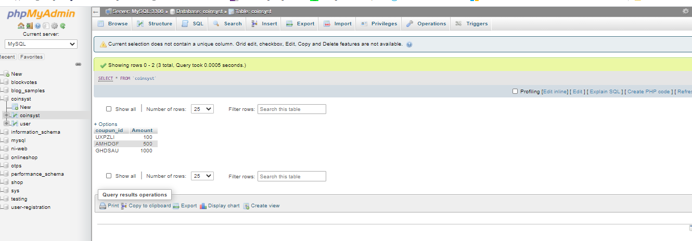
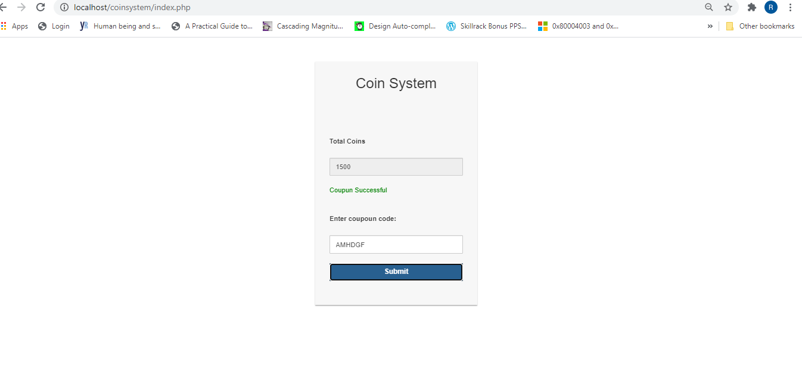

# Coin-System
Steps to run the project:- 
1. Clone the project to the respective Xamp or Wamp folder 
2. Run the index.php file 

Description:- 
The Coin System ckecks whether the Coupun code is Valid or not based on the valid coupouns stored in the database then upldates the result accordingly.  
<h2>OUTPUT Screenshots</h2>  
  
  
  
